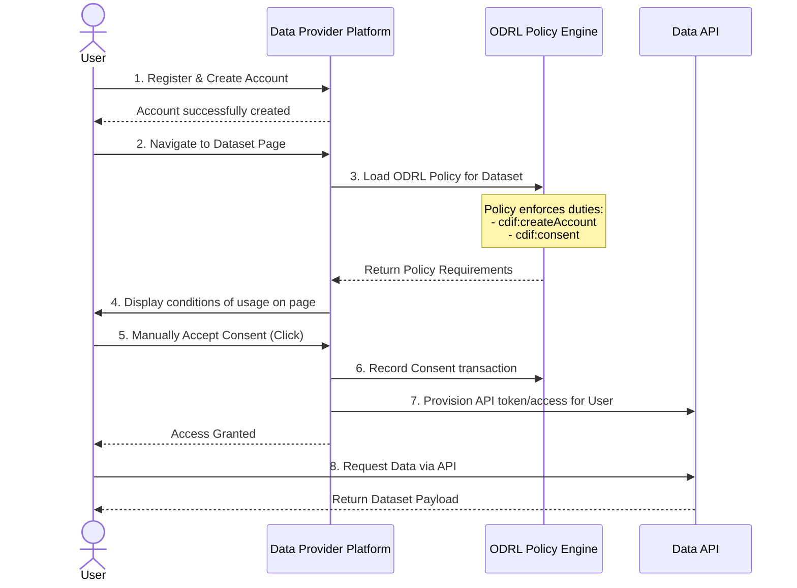

# ODRL Consent and API Access Workflow

This document describes the complete interaction workflow for a user attempting to access a dataset that is protected by a custom ODRL policy (like the Copernicus example), which mandates account creation and manual consent.

## Sequence Diagram

The following sequence diagram illustrates the step-by-step process between the User, the Data Provider's Platform, the ODRL Policy System, and the Data API.

## Step-by-Step Description

1. **Account Creation (`cdif:createAccount`)**: Before any data interaction occurs, the user must register on the Data Provider's platform to fulfill the initial prerequisite duty.
2. **Policy Loading**: When the user navigates to a specific dataset, the platform's backend queries the ODRL Policy Engine to load the machine-readable `.jsonld` license associated with that dataset. 
3. **Requirement Enforcement**: The engine interprets the ODRL duties. It verifies the user has an active account, and recognizes that a `cdif:consent` duty with a `cdif:manualClick` constraint is required.
4. **Consent Page**: The platform presents the specific conditions of usage to the user on the dataset page.
5. **Manual Consent (`cdif:consent`)**: The user explicitly accepts the usage conditions by clicking an acceptance button. 
6. **API Authorization**: Upon recording the consent, the system provisions the user with the necessary credentials (e.g., an API token).
7. **Data Access (`odrl:use`)**: The user can now successfully query the Data API and retrieve the dataset.
